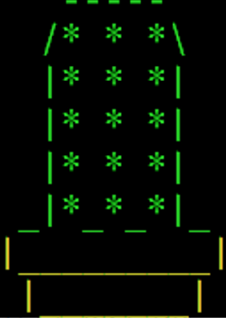

# 阿掌養成計畫🌵

## 遊戲介紹與規則

> 分數設定：第一關3000分 ➡️ 第二關7000分 ➡️ 第三關15000分 ➡️ 勝利 🎉🎉🎉

太陽和雨水會從天上隨機掉落，玩家使用左右方向鍵 ↔️ 操控阿掌🌵的左右移動，因為阿掌非常喜歡照太陽🌞🌞，所以當阿掌碰到太陽🌞🌞時，將會獲得能量⚡，相對的，因為阿掌極度厭惡下雨天🌧🌧，因此如果當阿掌碰到雨水💧💧時，將會失去一條生命💔💔，達到一定的能量後，遊戲將會進入下一關。
    
與此同時，我們可愛的阿掌將會依照關卡長大，每關都能看到不一樣的阿掌🌵喔，而太陽和雨水的數量，將會依照關卡難度提升↗🆙，而越來越多，除了使用左右鍵移動阿掌以外，按著Ctrl加左右鍵將會提升阿掌的移動速度喔(建議先按著Ctrl再按左右鍵才能加速)。

## 遊戲畫面


#### 成長中的阿掌🌵

 ➡️  ➡️ 

## 遊戲前置設定

``` no-highlight
`要記得將視窗大小調整為145*35，不然會gg`
```
